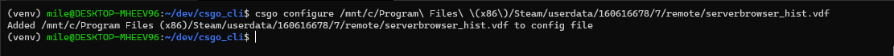

# CSGO Command Line Interface

CLI for starting CSGO and joining one of your favorite servers insanely fast.

Because why not?

# Usage

```
>>> csgo servers

  INDEX  NAME                                                                        MAP            PLAYERS    ADDRESS
-------  --------------------------------------------------------------------------  -------------  ---------  -------------------
    0  BrutalCS - RETAKES ★ 02 ★ MAPVOTE ★ 128T                                    de_train       10/10      178.236.67.18:27015
    1  BrutalCS - RETAKES ★ 04 ★ MAPVOTE ★ 128T                                    de_dust2       2/10      178.236.67.33:27015
    2  BrutalCS - RETAKES ★ 11 ★ MAPVOTE ★ 128T                                    de_mirage      4/10      178.236.67.56:27015
    3  BrutalCS - RETAKES ★ 13 ★ MAPVOTE ★ 128T                                    de_nuke        0/10      178.236.67.26:27015'


>>> csgo connect 3

Starting CSGO and joining server   BrutalCS - RETAKES ★ 13 ★ MAPVOTE ★ 128T ...
````

# Current installation
```
pip install csgo-cli
```


# Setup path to steam user data

Steam stores your favorite servers in a file called `serverbrowser_hist.vdf`. 

For me, this file was located at:
```/c/Program Files (x86)/Steam/userdata/160616678/7/remote/serverbrowser_hist.vdf"```.



When the `serverbrowser_hist.vdf` has been located, run: 
```
csgo configure {full_path_to_`serverbrowser_hist.vdf`}
```

Everything should now be set, enjoy!

# Contribute?
Feel free to create issues and PRs!
