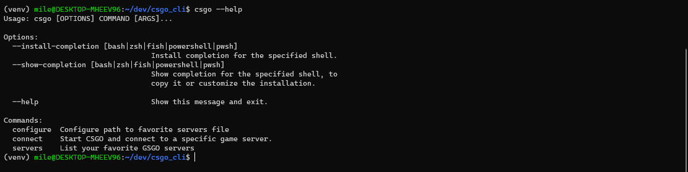
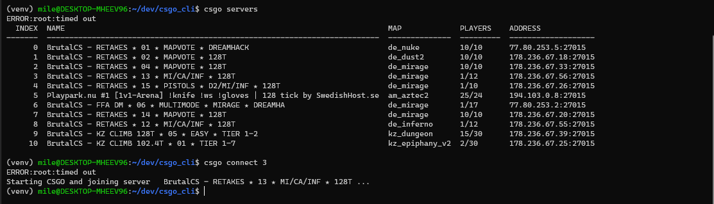

# CSGO Command Line Interface

CLI for starting CSGO and joining one of your favorite servers insanely fast.

Because why not?

# Usage




# Current installation
```
pip install csgo-cli
```


# Setup path to steam user data

Steam stores your favorite servers in a file called `serverbrowser_hist.vdf`. 

For me, this file was located at:
```/c/Program Files (x86)/Steam/userdata/160616678/7/remote/serverbrowser_hist.vdf"```.


When the `serverbrowser_hist.vdf` has been located, run: 
```
csgo configure {full_path_to_`serverbrowser_hist.vdf`}
```

Everything should now be set, enjoy!
